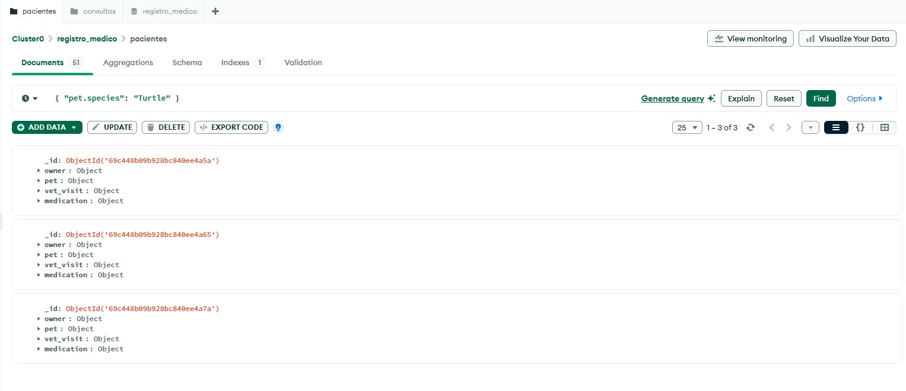
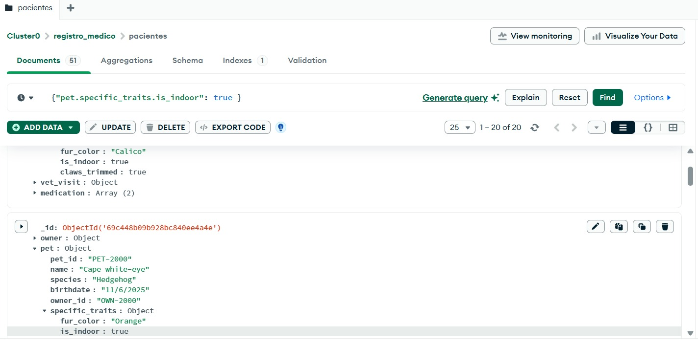
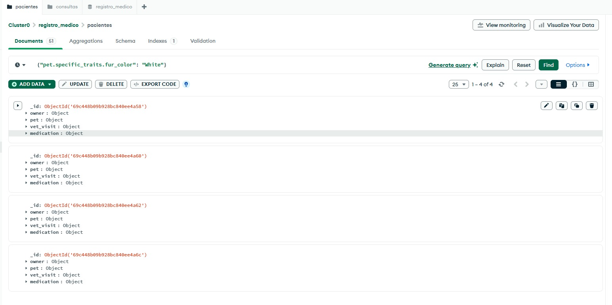
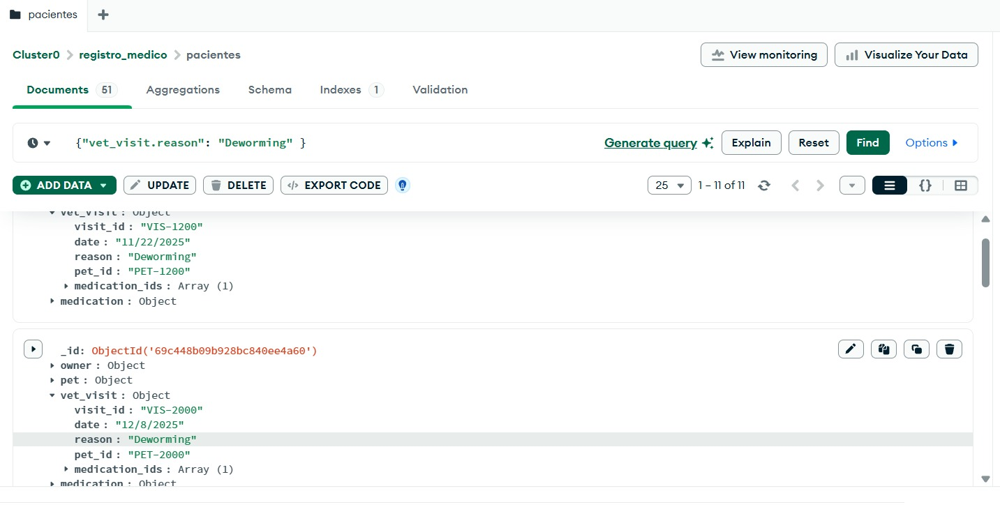
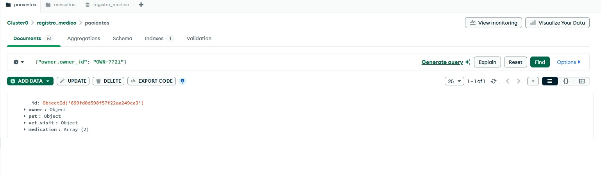
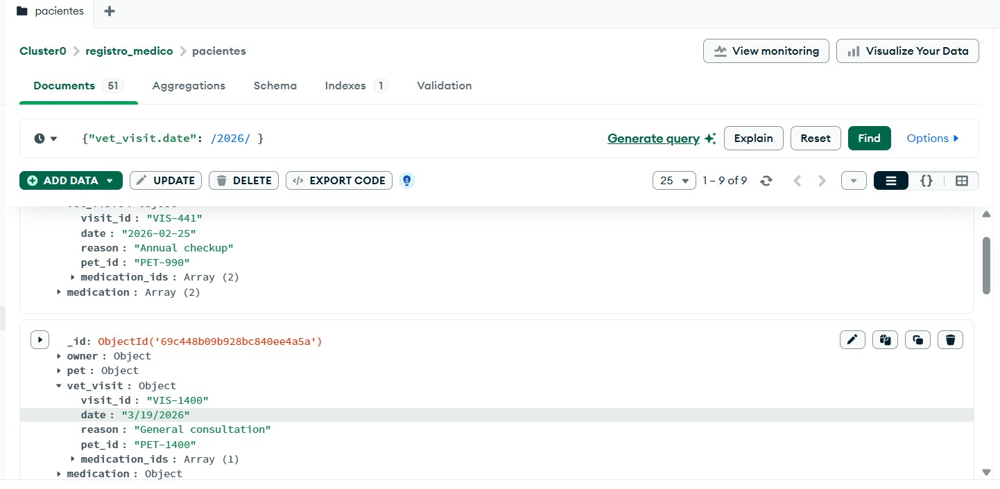
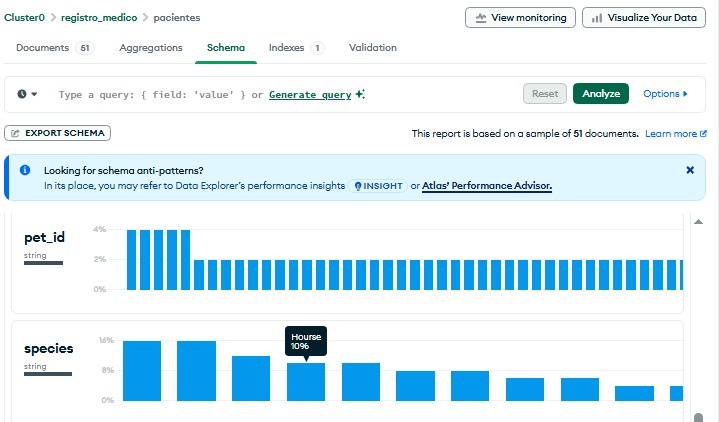

# PetHealth Connect: Gestión Veterinaria e Integral
## 📖 Tabla de Contenidos
 1. Descripción del Proyecto
 2. Guía de Inicio Rápido
 3. Arquitectura de Datos
 4. Estructura de Colecciones
 5. Instalación y Uso
 6. Tecnologías
## <a name="descripción"></a>Descripción
**PetHealth Connect** es una plataforma web integral diseñada para la gestión digital de servicios veterinarios, permitiendo a los dueños de mascotas agendar citas médicas y adquirir medicamentos especializados en un solo ecosistema optimizado. Este proyecto resuelve la desorganización de historiales médicos y la dificultad de acceso a suministros de salud animal, eliminando las barreras de comunicación entre la clínica y el usuario. Para el dueño de una mascota, representa la tranquilidad de tener un control total, rápido y centralizado sobre el bienestar de su compañero.
## ⚡ Guía de Inicio Rápido
Para tener el modelo de datos corriendo en tu máquina local en menos de 5 minutos, sigue estos pasos:
 1. **Clonar el repositorio:**
   ```bash
   git clone [https://github.com/tu-usuario/pethealth-connect.git](https://github.com/tu-usuario/pethealth-connect.git)
   cd pethealth-connect
   
   ```
 2. **Preparar la Base de Datos:**
   Asegúrate de tener instalado MongoDB Compass o tener una cuenta en MongoDB Atlas.
 3. **Importar los Datos (Semillas):**
   Ejecuta los siguientes comandos en tu terminal para cargar los 100 documentos de prueba:
   ```bash
   # Importar Dueños y Mascotas
   mongoimport --db vetDB --collection owners --file data/owners_pets_seed.json --jsonArray
   
   # Importar Ventas y Citas
   mongoimport --db vetDB --collection sales --file data/sales_seed.json --jsonArray
   
   ```
 4. **¡Listo!** Abre MongoDB Compass, conéctate a vetDB y comienza a explorar las colecciones.
## 🏗️ Arquitectura de Datos
Como **Data Modeler**, el diseño se centró en la eficiencia de lectura y la integridad histórica utilizando los siguientes patrones NoSQL:
 * **Patrón de Embebido (Embedded Pattern):** Las mascotas están anidadas dentro de sus dueños para reducir la latencia de las consultas de perfil.
 * **Patrón de Desnormalización:** Copia de precios unitarios en las ventas para proteger los registros contables contra cambios de precios en el catálogo.
 * **Esquema Polimórfico:** Uso de objetos flexibles para manejar rasgos específicos de diferentes especies animales sin columnas vacías.
## 📁 Estructura de Colecciones
El proyecto se divide en dos grandes ejes documentales:
 * **owners (Dueños & Mascotas):** Datos de contacto y perfil médico anidado de cada mascota.
 * **sales (Transacciones & Citas):** Registro de facturación, servicios prestados y medicamentos vendidos.
## 🛠️ Tecnologías Utilizadas
 * **Motor de DB:** MongoDB Atlas / Community Server
 * **Lenguaje de Datos:** JSON / BSON
 * **Gestión:** MongoDB Compass
 * **Documentación de Esquemas:** Markdown
© 2026 PetHealth Connect - Desarrollado bajo estándares de Modelado de Datos NoSQL.
© 2026 PetHealth Connect - Desarrollado bajo estándares de Modelado de Datos NoSQL.
## 👥 Team Roles and Responsibilities

| # | Technical Role | Main Responsibility (Weekly Sprints) |
| :--- | :--- | :--- |
| **1** | **The Data Modeler** <br>Porras Ramirez Alejandra | **JSON Architect.** Defines document structures. Decides between "embedding" vs "referencing" data. Designs Mermaid.js diagrams. |
| **2** | **The Query Developer** <br>Barragan Figueroa Tammy Nashieli| **MQL Constructor.** Translates business questions into MongoDB code (`db.collection.find()`). Works with AI to optimize filters. |
| **3** | **The Integration Specialist** <br>Hernandez Jimenez Brayan | **Environment Configurator.** Sets up Atlas Clusters or Compass connections. Manages basic indexes and GitHub repository administration. |
| **4** | **The Data Seeder / QA** <br>Perez Rosas Ximena Victoria | **Chaos Generator.** Creates mock data (JSON files) using AI or Mockaroo. Validates queries against real-world scenarios and reports bugs. |
| **5** | **The Scrum Master** <br>Ricaño Cansino Annel | **Process Facilitator.** Eliminates blockers, ensures the team follows the MongoDB sprint goals, and manages the "Definition of Done" for GitHub artifacts. |


# 🔍 Database Analysis and Queries (MQL)

The queries performed on the **Mundo Animal** database are essential tools for clinical management. They allow for the extraction of strategic information about both patients and owners to streamline veterinary care.

Below are the key queries implemented in this deliverable:

---

### 🐢 1. Inventory Count by Species
**Objective:** Identify how many patients of a specific species (e.g., Turtles or Hamsters) are registered to manage medical resources.
* **Code:** `{ "pet.species": "Turtle" }`
* **Field used:** `pet.species` to filter by taxonomic categories.



---

### 🏠 2. Lifestyle and Habitat Filter
**Objective:** Determine which pets live inside the home (indoor), which is critical for diagnoses related to their environment.
* **Code:** `{ "pet.specific_traits.is_indoor": true }`
* **Field used:** `pet.specific_traits.is_indoor` (boolean).



---

### 🎨 3. Identification by Physical Traits (Color)
**Objective:** Assist in the quick visual identification of a patient, especially useful in cases of loss or record confirmation.
* **Code:** `{ "pet.specific_traits.fur_color": "White" }`
* **Field used:** `pet.specific_traits.fur_color`.



---

### 🏥 4. Medical History Tracking (Reason for Visit)
**Objective:** Filter patients based on the reason for their visit, such as deworming or annual check-ups.
* **Code:** `{ "vet_visit.reason": "Deworming" }`
* **Field used:** `vet_visit.reason`.



---

### 🆔 5. Precision Search by ID
**Objective:** Locate a specific owner or pet uniquely and accurately using their assigned system code.
* **Code:** `{ "owner.owner_id": "OWN-7721" }`
* **Field used:** `owner.owner_id`.



---

### 📅 6. Chronological Control (Year and Month)
**Objective:** Perform visit audits by time periods, identifying new patient registrations in specific months or annual reports.
* **Code (Month):** `{ "vet_visit.date": /^1\// }`
* **Code (Year):** `{ "vet_visit.date": /2026/ }`
* **Technique:** Use of Regular Expressions (Regex).




---

### 📞 7. Contact Information Retrieval (Phone)
**Objective:** Quickly obtain the contact details of the person responsible for the pet for emergencies or appointment reminders.
* **Code:** `{ "owner.phone_number": "973-792-3632" }` 
* **Field used:** `owner.phone_number`.


---

### 📊 8. Data Distribution (Species Overview)
**Objective:** Visualize the variety of patients registered in the clinic using **MongoDB Compass Schema Analysis**. This tool helps the clinic understand at a glance which species are the most common in our database.

**Insights:** * As shown in the generated chart, **horse** currently represent **10%** of our total registered patients.
* This distribution allows the veterinary staff to better plan for specialized medical supplies (e.g., specific food or medicine for exotic pets).



---
### 📊 Sprint - Team Status Board

| Task ID | Role | Technical Specification | Definition of Done (DoD) | Tech Stack / Tag | Status |
| :--- | :--- | :--- | :--- | :--- | :--- |
| **VET-INT-01** | **Integration Specialist**<br>*(Brayan Hernandez)* | • Transition MQL filters into live environment.<br>• Validate boundary conditions for `$gt`, `$lt`, `$in`, and `$ne`. | • `db.products.find()` runs with 0 syntax errors.<br>• Query performance verified in MongoDB Compass. | `MQL` / `Atlas` / `Filters` |  🟢 To Do |
| **VET-QRY-01** | **Query Developer**<br>*(Tammy Nashely)* | • Optimize retrieval times using Indexing.<br>• Refactor Regex filters to enforce case-insensitive matching (`$options: "i"`). | • Execution time stays under 50ms via MongoDB Profiler.<br>• Emergency phone-number lookup algorithm fully verified. | `Regex` / `Indexing` / `Profiler` |  🟢 To Do|
| **VET-ARC-01** | **Data Modeler & Architect**<br>*(Alejandra Porras)* | • Document the unified English schema foundations.<br>• Implement JSON Schema Validation rules for data types. | • Validation scripts successfully block Spanish keys.<br>• 100% agreement on relational links between collections. | `JSON Schema` / `Validation` | 🟢 To Do |
| **VET-SED-01** | **Data Seeder**<br>*(Research Role)* | • Configure Mockaroo formulas for conditional logic.<br>• Execute large-scale data ingestion via terminal. | • Generate a clean dataset with 1.5 million valid entities.<br>• Successful import via `mongoimport` CLI tool. | `Mockaroo` / `mongoimport` |  🟢 To Do |
