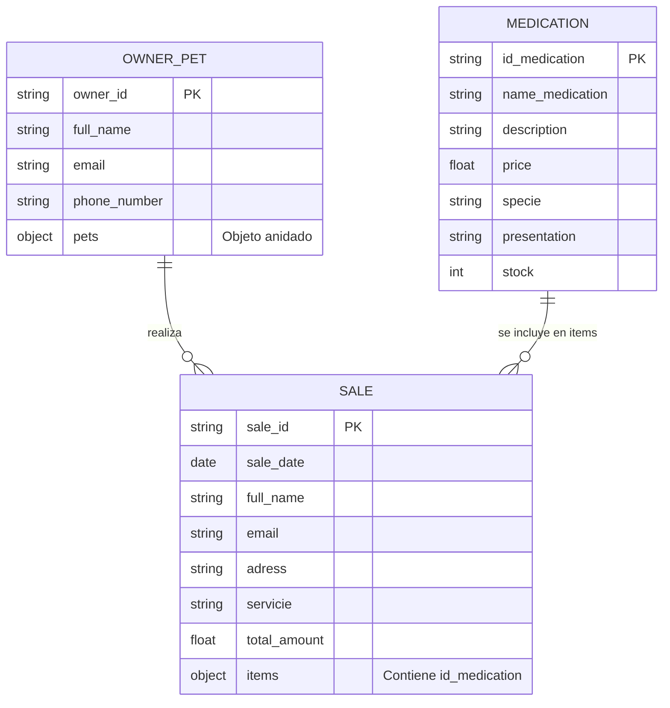

```mermaid
   erDiagram
    OWNER_PET ||--o{ SALE: "realiza"
    MEDICATION ||--o{ SALE: "se incluye en items"

    OWNER_PET {
        string owner_id PK
        string full_name
        string email
        string phone_number
        object pets "Objeto anidado"
    }

    SALE {
        string sale_id PK
        date sale_date
        string full_name
        string email
        string adress
        string servicie
        float total_amount
        object items "Contiene id_medication"
    }

    MEDICATION {
        string id_medication PK
        string name_medication
        string description
        float price
        string specie
        string presentation
        int stock
    }

```
