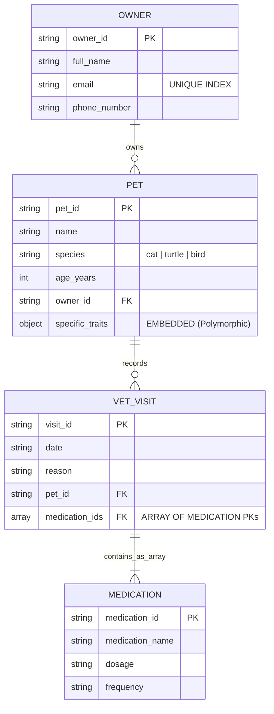

```mermaid
erDiagram
    OWNER ||--o{ PET : owns
    PET ||--o{ VET_VISIT : records
    VET_VISIT ||--|{ MEDICATION : contains_as_array

    OWNER {
        string owner_id PK
        string full_name
        string email "UNIQUE INDEX"
        string phone_number
    }

    PET {
        string pet_id PK
        string name
        string species "cat | turtle | bird"
        int age_years
        string owner_id FK
        object specific_traits "EMBEDDED (Polymorphic)"
    }

   VET_VISIT {
        string visit_id PK
        string date
        string reason
        string pet_id FK
        array medication_ids FK "ARRAY OF MEDICATION PKs"
    }

    MEDICATION {
        string medication_id PK
        string medication_name
        string dosage
        string frequency
    }
```
