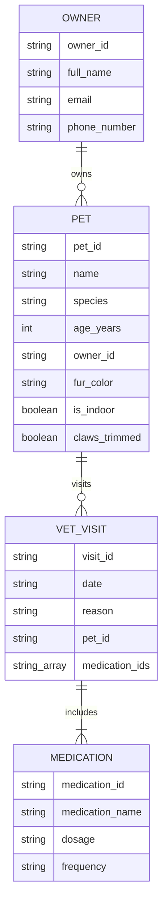

```mermaid
erDiagram
    OWNER ||--o{ PET : owns
    PET ||--o{ VET_VISIT : visits
    VET_VISIT ||--|{ MEDICATION : includes

    OWNER {
        string owner_id
        string full_name
        string email
        string phone_number
    }

    PET {
        string pet_id
        string name
        string species
        int age_years
        string owner_id
        string fur_color
        boolean is_indoor
        boolean claws_trimmed
    }

    VET_VISIT {
        string visit_id
        string date
        string reason
        string pet_id
        string_array medication_ids
    }

    MEDICATION {
        string medication_id
        string medication_name
        string dosage
        string frequency
    }
```
